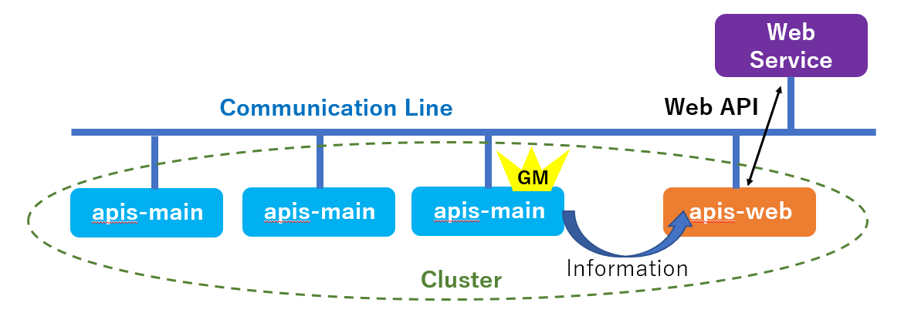
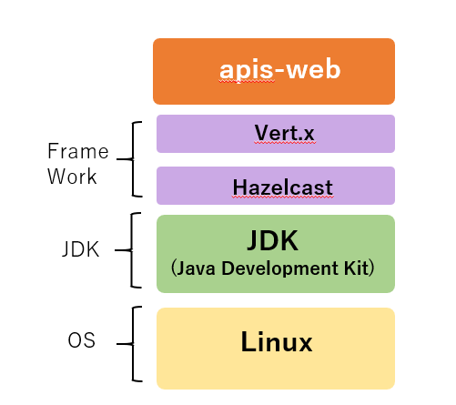
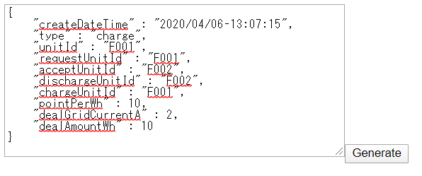

**apis-web Specification**
=====
**Rev 0.67**

# **Contents**
- [**apis-web Specification**](#apis-web-specification)
- [**Contents**](#contents)
- [**1. Terms and Abbreviation**](#1-terms-and-abbreviation)
- [**2. Overview**](#2-overview)
- [**3. Software Composition**](#3-software-composition)
  - [**3.1. Software Architecture**](#31-software-architecture)
  - [**3.2. Software Composition**](#32-software-composition)
- [**4. Description of Functions**](#4-description-of-functions)
  - [**4.1. Formation of Clusters**](#41-formation-of-clusters)
  - [**4.2. Budo Emulator**](#42-budo-emulator)
  - [**4.3. Emulator Emulator**](#43-emulator-emulator)
  - [**4.4. API Server**](#44-api-server)
    - [**4.4.1. Deal Generator**](#441-deal-generator)
    - [**4.4.2. Error Generator**](#442-error-generator)
    - [**4.4.3. Log Configurator**](#443-log-configurator)
- [**5. Communication Specifications**](#5-communication-specifications)
  - [**5.1. Web API**](#51-web-api)
  - [**5.2. apis-web-Grid Master Communication**](#52-apis-web-grid-master-communication)
- [**6. Collected Information**](#6-collected-information)
  - [**6.1. Emulator Emulator /get/log**](#61-emulator-emulator-getlog)
  - [**6.2. Budo Emulator /deals**](#62-budo-emulator-deals)
- [**7. Configuration Files**](#7-configuration-files)
  - [**7.1. config.json**](#71-configjson)
  - [**7.2. cluster.xml**](#72-clusterxml)
  - [**7.3. logging.properties**](#73-loggingproperties)
  - [**7.4. start.sh**](#74-startsh)
  - [**7.5. stop-kill.sh**](#75-stop-killsh)
  - [**7.6. key.pem**](#76-keypem)
  - [**7.7. cert.pem**](#77-certpem)
- [**8. Log Output**](#8-log-output)
  - [**8.1. Log Level**](#81-log-level)
  - [**8.2. Output Destination of APIS Action Log**](#82-output-destination-of-apis-action-log)
- [**9. Error Handling**](#9-error-handling)
- [**10. Security**](#10-security)
  - [**10.1. Inter-APIS Communication Security**](#101-inter-apis-communication-security)
- [**11. Privacy**](#11-privacy)
- [**12. Open Source Software Licenses**](#12-open-source-software-licenses)
- [**13. Operating Environment**](#13-operating-environment)
  - [**13.1. Recommended Hardware Specifications**](#131-recommended-hardware-specifications)
  - [**13.2. Recommended Operating System Specifications**](#132-recommended-operating-system-specifications)

 

# **1. Terms and Abbreviation**

| **Term**        | **Description**                                                                                                                                               |
| --------------- | ------------------------------------------------------------------------------------------------------------------------------------------------------------- |
| apis-main       | Software for power interchange developed by Sony CSL that enables autonomous decentralized control.                                                           |
| Grid Master     | Name of service included in apis-main. Controls the DC grid to exchange electricity.                                                                          |
| Hazelcast       | In-memory distributed computing library that accelerates applications by distributing data across multiple machines and carrying out parallel processing.     |
| Vert.x          | A framework for implementing load balanced programs. Using Hazelcast, the Event Bus is clustered and processed with load balancing.                           |
| Verticle        | The basic processing unit of a Vert.x program is called a Verticle.                                                                                           |
| Event Bus       | The basic processing unit of a Vert.x program is called a Verticle. The Event Bus is an asynchronous interface for verticle-to-verticle communications.       |
| Main Controller | Web application developed by Sony CLS for displaying the conditions of each node installed by apis-main and the conditions of power interchange in real time. |
| Budo            | Name of automated power interchange software for centralized management and control prior to study of autonomous decentralized control of energy.             |

 

# **2. Overview**

apis-web is a software program that provides power interchange-related information to Web services (such as a visualization service) for the development, operation, and maintenance of power interchange. To get information from apis-main installed in multiple nodes connected on a communication lines such as Ethernet, apis-web forms a cluster by using Vert.x and Hazelcast framework functions. From Grid Master in the cluster, it gets hardware information such as the DC/DC converter and battery RSoC information of all nodes and power interchange information from any node. apis-web also has functions to generate power interchange and errors for debugging purposes.

  
Fig. 2-1

 

# **3. Software Composition**

## **3.1. Software Architecture**

Fig. 3-1 shows the software architecture of apis-web. The Java Development Kit (JDK) is installed on the Linux operating system. apis-web runs on two JDK frameworks: event-driven load balancing platform Vert.x and in-memory distributed computing platform Hazelcast. (For versions of verified open source software used, see 12. Open Source Software Licenses.)

  
Fig. 3-1

 

## **3.2. Software Composition**

apis-web provides three services, as shown in Fig. 3-2.

1)  Budo Emulator  
   This service provides information about power interchanges generated in a cluster to Web applications such as Main Controller. It also enables changing settings of apis-mains of all nodes or individual nodes for actions such as executing and stopping power interchanges. Programs such as Main Controller visualize the power interchange conditions within a cluster based on information received from apis-web. (The appellation “Emulator” comes from the service’s functions that emulate providing Budo information.)

 

2)  Emulator Emulator  
   This service provides hardware information to Web applications such as Main Controller. The hardware information includes conditions of DC/DC converters and batteries in all nodes obtained from each node’s apis-main. (The name “Emulator Emulator” comes from the fact that in developing this service to provide information about actual hardware to Web applications such as Main Controller, developers appropriated already developed Web API that had DC/DC converter and Battery hardware emulator functions. So from the standpoint of a Web application, the service emulates an emulator.)

 

3)  API Server  
   This service provides the following Web API primarily for purposes such as debugging.  
   * Deal Generator :  
    Web API to intentionally generate a power interchange execution command within a cluster.
   * Error Generator :  
    Web API to intentionally generate a chosen error handling command within a cluster.
   * Log Configurator :  
    Web API to dynamically change the level of the UDP log output to apis-main on the communication line.

  
Fig. 3-2

 

# **4. Description of Functions**
    
## **4.1. Formation of Clusters**

When apis-web started, a Hazelcast Cluster Manager implemented by the Vert.x framework is used to form clusters of multiple apis-mains on the communication line. A cluster is composed of apis-mains that have the same cluster name specified in their cluster.xml configuration files.

 

## **4.2. Budo Emulator**

* Budo Emulator gets the following information, sets the power interchange mode, and carries out shutdown processes for Grid Master and nodes. (The Global power interchange mode applies to all nodes. The Local power interchange mode applies to a particular node.)

  * Grid Master:  
   Gets a list of all nodes in a cluster.
  * Any node:  
   Gets power interchange information and Global power interchange mode status and sets Global power interchange mode.
  * Particular node:  
   Gets local power interchange status, sets Local power interchange mode and shuts down particular node.
  * All nodes:  
   Shuts down all nodes.

* There are four power interchange modes:
  * Run (autonomous) :  
   Standard mode during power interchange operation, which enables the generation of power interchanges within a cluster.
  * Soft Stop (heteronomous) :  
   Mode in which existing power interchanges continue until completed and new power interchanges are not generated. Because a power interchange can be force generated by Deal Generator, this mode is primarily used for debugging purposes.
  * Force Stop (stop) :  
   Mode in which existing power interchanges are stopped and generations of new power interchanges, including forced generations by Deal Generator, are not carried out. This mode is used to force stop power interchanges in a cluster when a problem occurs.
  * Manual (manual) :  
   Mode for debugging. Used to manually operate the DC/DC converter and other equipment without affecting apis-main’s protection functions.

 

## **4.3. Emulator Emulator**

This service can get hardware information such as conditions of DC/DC converters and batteries in all nodes participating in a cluster all at once.

 

## **4.4. API Server**
    
### **4.4.1. Deal Generator**

When the Deal Generation Web API is executed, the window below opens in the browser. You can intentionally generate a power interchange execution command by entering power interchange information in JSON format and clicking the “Generate” button. This function is mainly used for debugging purposes.

 

### **4.4.2. Error Generator**

When the Error Generation Web API is executed, the window below opens in the browser. You can generate selected error handling in a cluster by choosing the error categories and clicking the “Generate” button. This function is mainly used for debugging purposes.

 

### **4.4.3. Log Configurator**

The output of apis-main’s UDP log, which is outputted to the communication line, is turned off or its level of output is restricted based on considerations of the possibility of data breaches and the amount of data traffic. Output settings are configured in apis-main’s logging.properties file. If you wish to temporarily change the UDP log output level for debugging purposes, you can use the Log Configurator function. (The effects of this function are temporary. The output level of UDP log follows apis-main’s logging.properties file after apis-main is restarted.)

 

# **5. Communication Specifications**
    
## **5.1. Web API**

Web applications such as Main Controller can exchange information with apis-web using the following Web API. The following describes the Web API specifications.

<table>
<tbody>
<tr class="even">
<td rowspan="9">
Budo

Emulator functions
</td>
<td>/shutdown</td>
<td>Instruct shutdown of all or individual nodes.</td>
</tr>
<tr class="odd">
<td>/setOperationMode</td>
<td>Set Global or Local operation mode.</td>
</tr>
<tr class="even">
<td>/deals</td>
<td>Get power interchange information.</td>
</tr>
<tr class="odd">
<td>/unitIds</td>
<td>Get list of node IDs.</td>
</tr>
<tr class="even">
<td>/getStatus</td>
<td>Get status of Global operation mode.</td>
</tr>
<tr class="odd">
<td>/active</td>
<td>Set Global operation mode (Run).</td>
</tr>
<tr class="even">
<td>/quiet</td>
<td>Set Global operation mode (Soft stop).</td>
</tr>
<tr class="odd">
<td>/stop</td>
<td>Set Global operation mode (Force stop).</td>
</tr>
<tr class="even">
<td>/manual</td>
<td>Set Global operation mode (Manual).</td>
</tr>
<tr class="odd">
<td>
Emulator

Emulator functions
</td>
<td>/get/log</td>
<td>Get hardware information from all nodes, such as DC/DC converter conditions and battery RSoC.</td>
</tr>
<tr class="even">
<td rowspan="3">API Server functions</td>
<td>/deal</td>
<td>Generate power interchange (for testing purposes).</td>
</tr>
<tr class="odd">
<td>/error</td>
<td>Generate error (for testing purposes).</td>
</tr>
<tr class="even">
<td>/log</td>
<td>Change the output level of apis-main’s UDP log.</td>
</tr>
</tbody>
</table>

 

## **5.2. apis-web-Grid Master Communication**

After receiving Web API (“/get/log”, ”/deals”, etc.) from a Web application such as Main Controller, apis-web sends a request to Grid Master in the cluster to gather needed information from the Event Bus and waits for Grid Master’s response. After receiving the request from apis-web, Grid Master returns hardware and power interchange information to apis-web based on the content of the request. After receiving the information, apis-web returns it to the requester—e.g. Main Controller—in JSON format.

 

# **6. Collected Information**
    
## **6.1. Emulator Emulator /get/log**

Power interchange information that can be obtained by Web API “/get/log”, which is processed by Emulator Emulator, is as follows. The hardware information of all nodes can be obtained as a set.

<table>
<tbody>
<tr class="even">
<td rowspan="6">apis</td>
<td>version</td>
<td>Version of apis-main</td>
</tr>
<tr class="odd">
<td>remaining_capacity_wh</td>
<td>Remaining battery capacity (Wh)</td>
</tr>
<tr class="even">
<td>deal_interlock_capacity</td>
<td>In the case of setting one slot for one interchange, the number of slots that can carry out interchanges simultaneously.</td>
</tr>
<tr class="odd">
<td>operation_mode.global</td>
<td>
Set operation mode of clusters globally.

autonomous: Usual power interchange mode

heteronomous: Continue existing power interchanges. Disable generation of new power interchanges.

stop: Mode in which the power interchange is stopped

manual: Manual mode (for testing purposes)
</td>
</tr>
<tr class="even">
<td>operation_mode.local</td>
<td>
Set a node’s own operation mode.

&lt;Empty&gt;: Follow operation_mode.global

heteronomous: Continue existing power interchange. Disable generation of new power interchanges.

stop: Mode in which the power interchange is stopped

Set a node’s own operation mode.

&lt;Empty&gt;: Follow operation_mode.global

heteronomous: Continue existing power interchange. Disable generation of new power interchanges

stop: Mode in which the power interchange is stopped
</td>
</tr>
<tr class="odd">
<td>operation_mode.effective</td>
<td>
Effective operation mode

Determined by combining global and local operation modes
</td>
</tr>
<tr class="even">
<td rowspan="10">oesunit</td>
<td>communityId</td>
<td>Community ID</td>
</tr>
<tr class="odd">
<td>clusterId</td>
<td>Cluster ID</td>
</tr>
<tr class="even">
<td>id</td>
<td>Node ID</td>
</tr>
<tr class="odd">
<td>display</td>
<td>Node name</td>
</tr>
<tr class="even">
<td>sn</td>
<td>Node serial number</td>
</tr>
<tr class="odd">
<td>budo</td>
<td>
Under the previous system, this flag was used to indicate that automatic interchange has become active. However, in the current system, this flag is used to indicate whether or not operation_mode.effective is autonomous.

Autonomous: 1

Otherwise: 0
</td>
</tr>
<tr class="even">
<td>ip</td>
<td>IPv4</td>
</tr>
<tr class="odd">
<td>Ipv6_ll</td>
<td>IPv6 link-local unicast address</td>
</tr>
<tr class="even">
<td>Ipv6_g</td>
<td>IPv6 global unicast address</td>
</tr>
<tr class="odd">
<td>mac</td>
<td>MAC address</td>
</tr>
<tr class="even">
<td rowspan="2">battery</td>
<td>rsoc</td>
<td>Relative remaining capacity (relative state-of-charge) (%)</td>
</tr>
<tr class="odd">
<td>battery_operation_status</td>
<td>Flag for permitting/denying power interchange</td>
</tr>
<tr class="even">
<td colspan="2">time</td>
<td>Time of apis-main node</td>
<td></td>
</tr>
<tr class="odd">
<td rowspan="21">dcdc</td>
<td>status.status</td>
<td>Status</td>
</tr>
<tr class="even">
<td>status.alarm</td>
<td>Alarm number</td>
</tr>
<tr class="odd">
<td>status.stateAlarm</td>
<td>Alarm information</td>
</tr>
<tr class="even">
<td>status.statusName</td>
<td>Name of DC/DC converter status</td>
</tr>
<tr class="odd">
<td>status.runningState</td>
<td>DC/DC converter action status</td>
</tr>
<tr class="even">
<td>status.operationMode</td>
<td>Operation Mode</td>
</tr>
<tr class="odd">
<td>meter.wb</td>
<td>DC grid power (W)</td>
</tr>
<tr class="even">
<td>meter.vg</td>
<td>DC grid voltage (V)</td>
</tr>
<tr class="odd">
<td>meter.ig</td>
<td>DC grid current (A)</td>
</tr>
<tr class="even">
<td>meter.wb</td>
<td>Battery power (W)</td>
</tr>
<tr class="odd">
<td>meter.vb</td>
<td>Battery voltage (V)</td>
</tr>
<tr class="even">
<td>meter.ib</td>
<td>Battery current (A)</td>
</tr>
<tr class="odd">
<td>meter.tmp</td>
<td>Internal temperature (℃)</td>
</tr>
<tr class="even">
<td>vdis.dvg</td>
<td>DC grid’s target voltage (V)</td>
</tr>
<tr class="odd">
<td>vdis.drg</td>
<td>DC grid droop rate (%)</td>
</tr>
<tr class="even">
<td>param.dig</td>
<td>DC grid upper-limit current (A)</td>
</tr>
<tr class="odd">
<td>param.ogv</td>
<td>DC grid’s excess voltage threshold (V)</td>
</tr>
<tr class="even">
<td>param.ugv</td>
<td>DC grid’s low voltage threshold (V)</td>
</tr>
<tr class="odd">
<td>param.cib</td>
<td>Battery’s upper-limit current (A)</td>
</tr>
<tr class="even">
<td>param.obv</td>
<td>Battery’s excess voltage threshold (V)</td>
</tr>
<tr class="odd">
<td>param.ubv</td>
<td>Battery’s low voltage threshold (V)</td>
</tr>
</tbody>
</table>

 

## **6.2. Budo Emulator /deals**

Power interchange information that can be obtained by the Web API “/deals”, which is processed by the Budo Emulator, is as follows. Multiple pieces of information on power interchanges being carried out at that point in time can be obtained as a set of information.

<table>
<tbody>
<tr class="even">
<td>unitId</td>
<td>Node identification ID</td>
</tr>
<tr class="odd">
<td>negotiationId</td>
<td>Power interchange negotiation ID</td>
</tr>
<tr class="even">
<td>requestUnitId</td>
<td>ID of node that requested the power interchange</td>
</tr>
<tr class="odd">
<td>acceptUnitId</td>
<td>ID of node that accepted the power interchange</td>
</tr>
<tr class="even">
<td>requestDateTime</td>
<td>Date and time when power interchange was requested</td>
</tr>
<tr class="odd">
<td>acceptDateTime</td>
<td>Date and time when power interchange was accepted</td>
</tr>
<tr class="even">
<td>requestPointPerWh</td>
<td>Points per watt-hour presented by the requesting side</td>
</tr>
<tr class="odd">
<td>acceptPontPerWh</td>
<td>Points per watt-hour presented by the accepting side</td>
</tr>
<tr class="even">
<td>requestDealGridCurrentA</td>
<td>Value of the current in the interchange presented by the requesting side</td>
</tr>
<tr class="odd">
<td>acceptDealGridCurrentA</td>
<td>Value of the current in the interchange presented by the accepting side</td>
</tr>
<tr class="even">
<td>type</td>
<td>Type of power interchange request (Charge/Discharge)</td>
</tr>
<tr class="odd">
<td>chargeUnitId</td>
<td>ID of charging node</td>
</tr>
<tr class="even">
<td>dischargeUnitId</td>
<td>ID of discharging node</td>
</tr>
<tr class="odd">
<td>pointPerWh</td>
<td>Points per watt-hour during actual power interchange</td>
</tr>
<tr class="even">
<td>chargeUnitEfficientGridVoltageV</td>
<td>Efficient grid voltage of charging node</td>
</tr>
<tr class="odd">
<td>dischargeUnitEfficientGridVoltageV</td>
<td>Efficient grid voltage of discharging node</td>
</tr>
<tr class="even">
<td>dealGridCurrentA</td>
<td>Current value (A) during power interchange</td>
</tr>
<tr class="odd">
<td>requestAmountWh</td>
<td>Electrical energy presented by the requesting side</td>
</tr>
<tr class="even">
<td>acceptAmountWh</td>
<td>Electrical energy presented by the accepting side</td>
</tr>
<tr class="odd">
<td>dealAmountWh</td>
<td>Electrical energy (Wh) during power interchange</td>
</tr>
<tr class="even">
<td>dealId</td>
<td>ID assigned to power interchange information</td>
</tr>
<tr class="odd">
<td>createDateTime</td>
<td>Date and time when the power interchange information was created for the power interchange</td>
</tr>
<tr class="even">
<td>
compensationTargetVoltage

ReferenceGridCurrentA
</td>
<td>Target value (A) of current compensation at Voltage Reference node</td>
</tr>
<tr class="odd">
<td>activateDateTime</td>
<td>Date and time when the Constant Voltage node starts up</td>
</tr>
<tr class="even">
<td>rampUpDateTime</td>
<td>Date and time when DC grid’s voltage ramp-up is complete</td>
</tr>
<tr class="odd">
<td>warmUpDateTime</td>
<td>Date and time when the Constant Current node starts up</td>
</tr>
<tr class="even">
<td>
dischargeUnitCompensated

GridCurrentA
</td>
<td>Discharge current (A) after current compensation</td>
</tr>
<tr class="odd">
<td>
chargeUnitCompensated

GridCurrentA
</td>
<td>Charge current (A) after current compensation</td>
</tr>
<tr class="even">
<td>startDateTime</td>
<td>Date and time when actual power interchange begins</td>
</tr>
<tr class="odd">
<td>cumulateDateTime</td>
<td>Date and time when interchanged power is actually accumulated</td>
</tr>
<tr class="even">
<td>cumulateAmountWh</td>
<td>Total electrical power (watt-hour) after power is actually interchanged</td>
</tr>
<tr class="odd">
<td>stopDateTime</td>
<td>Date and time when actual power interchange stops</td>
</tr>
<tr class="even">
<td>deactiveateDateTime</td>
<td>Date and time when post-power interchange processing is complete</td>
</tr>
</tbody>
</table>

 

# **7. Configuration Files**

apis-web has multiple configuration files and key files. These files are described below.

 

## **7.1. config.json**

The following basic information for configuring apis-web is set in a JSON-format file. The file is read once when apis-web starts up, so if a parameter is changed, apis-web must be restarted.

<table>
<tbody>
<tr class="even">
<td>programId</td>
<td>Program identification string</td>
</tr>
<tr class="odd">
<td>comminityId</td>
<td>Community identification string. Higher-level ID when organizing one or more clusters. Also used as seed for encryption, together with clusterId and the APIS version string.</td>
</tr>
<tr class="even">
<td>clusterId</td>
<td>
Cluster identification string

Used as seed for encryption, together with comminityId and the APIS version string.
</td>
</tr>
<tr class="odd">
<td>security.enabled</td>
<td>Setting for enabling/disabling encryption of shared memory and using SSL for the Event Bus</td>
</tr>
<tr class="even">
<td>security.pemKeyFile</td>
<td>Secret key used for Event Bus SSL</td>
</tr>
<tr class="odd">
<td>security.pemCertFile</td>
<td>Certificate used for Event Bus SSL</td>
</tr>
<tr class="even">
<td>bodoEmulator.port</td>
<td>Port number for Budo Emulator Port = 43830</td>
</tr>
<tr class="odd">
<td>emulatorEmulator.port</td>
<td>Port number for Emulator Emulator Port = 43900</td>
</tr>
<tr class="even">
<td>apiServer.port</td>
<td>Port number for Generate Deal, Generate Error Port = 9999</td>
</tr>
<tr class="odd">
<td>watchdog.enabled</td>
<td>Setting for enabling/disabling APIS alive information</td>
</tr>
<tr class="even">
<td>watchdog.periodMsec</td>
<td>Watch dog reset cycle (ms)</td>
</tr>
<tr class="odd">
<td>watchdog.host</td>
<td>IP address accessed by the watch dog service at the interval specified by periodMsec</td>
</tr>
<tr class="even">
<td>watchdog.port</td>
<td>Port number accessed by the watch dog service at the interval specified by periodMsec</td>
</tr>
<tr class="odd">
<td>watchdog.uri</td>
<td>URI of the watch dog service</td>
</tr>
<tr class="even">
<td>
watchdog.requestTimeout

Msec
</td>
<td>Timeout of watch dog service (ms)</td>
</tr>
</tbody>
</table>

 

## **7.2. cluster.xml**

File in XML format that sets the parameters (such as cluster name, passwords, network settings, multicast settings, etc.) required by Hazelcast when forming clusters.

Encrypted and saved as cluster.xml.encrypted.

 

## **7.3. logging.properties**

File containing settings related to the output of Java’s standard logging API java.util.logging (destination of log file, storage capacity of log file, log level configuration, etc.).

 

## **7.4. start.sh**

Script file for starting up apis-web. It is automatically run when the operating system starts up.

The command to start apis-web in start.sh is as follows:

> java -Djava.net.preferIPv4Stack=true -Duser.timezone=Asia/Tokyo -Djava.util.logging.config.file=./logging.properties -jar ./apis-web-2.23.0-a01-fat.jar -conf ./config.json -cp ./ -cluster -cluster-host 192.168.0.1 &

The arguments after “java” are described here.

* Djava.net.preferIPv4Stack=true  
-> Option to bind IPv4 address.

* Duser.timezone=Asia/Tokyo  
-> Time zone setting

* Djava.util.logging.config.file=./logging.properties  
-> Option for specifying the logging configuration file.

* jar ./apis-web-2.23.0-a01-fat.jar  
-> Option for specifying the execution of program encapsulated in the JAR file.

* conf ./config.json  
-> Option for specifying the configuration file.

* cp ./  
-\> Option for specifying the location of cluster.xml file.

* cluster-host 192.168.0.1 &  
->Option for specifying own IP address.

 

## **7.5. stop-kill.sh**

Script file for stopping apis-web.

After the shutdown function (stop) is executed via the Event Bus, apis-web’s own Java processes are forced to terminate if time out occurs. It is possible to specify the timeout in seconds in the script.

 

## **7.6. key.pem**

Secret key used when applying SSL to the Event Bus.

 

## **7.7. cert.pem**

Certificate used for applying SSL to the Event Bus.

 

# **8. Log Output**
    
## **8.1. Log Level**

The standard Java API java.util.logging is used for log output. Logging is divided into the seven levels described below. APIS logging does not output the “CONFIG” and “FINER” levels. The destinations of the APIS action log, log levels to be saved, maximum log size, maximum number of records to be saved, etc. are set in the logging.properties file.

\[java.util.logging Log Level\]

1. SEVERE  
   →Level used when an error occurs during execution.  
   When a log of this level is outputted, it is considered that some sort of problem has occurred.  
   \<Example\> When there is access to a Web API (URL) that has not been provided.

1. WARNING  
   →Level used to issue a warning for unexpected behavior during execution that is not an error.  
   \<Example\> Hardware information or other information in a node obtained from Grid Master is blank.

1. INFO  
   →Level used for outputting normal system information during execution. For apis-web, this level is outputted after processing a significant event.  
    \<Example\> API-provided port, etc.

1. CONFIG  
   →This log level outputs information related to settings. This level is not outputted in the log for apis-web.

1. FINE  
   →This level is used for outputting normal behavior information during execution.  
   \<Example\> Number of acquisitions of node information from Grid Master

1. FINER  
   →Starting and ending information for particular processes. This level is not outputted in the log for apis-web.

1. FINEST  
   →This level is used to output normal behavior information during execution.  
   \<Example\> When a Vert.x Verticle is started.

 

## **8.2. Output Destination of APIS Action Log**

The apis-web action log has three output destinations: UDP, console, and file. Enabling/disabling each output and applying restrictions on the output level as explained in the previous section can be set in logging.properties. Because UDP is outputted on the communication line, set the log after taking into consideration security against data breaches and the amount of data traffic. Set file output after taking into consideration the amount of non-volatile memory available.

 

# **9. Error Handling**

When a problem occurs, logs are output to file, UDP, and console. However, there are no functions to reset or stop itself.

 

# **10. Security**
    
## **10.1. Inter-APIS Communication Security**

Exchanges between apis-web and Grid Master are carried out using Event Bus communication and Hazelcast frameworks, which are supported by the Vert.x and Hazelcast frameworks. Each type of communication is encrypted using the following methods for security.

1) Event Bus communication  
   \- SSL public key cryptography (RSA)  
   \- SSL self-signed certificate

1) Hazelcast communication  
   \- Symmetric key cryptography (AES 128-bit)

 

# **11. Privacy**

Personal information must be handled with care because the act of sending personal information to an external server without permission from the owner may be subject to the General Data Production Regulation (GDPR) and other regulations that protect personal information. Whether or not information that can be obtained by the Web API is considered personal information depends on the geographic region in which apis-web is deployed, so confirmation is necessary.

 

# **12. Open Source Software Licenses**

The following table shows the software used by apis-web and information about their open source software licenses. apis-web only links to Adopt OpenJDK libraries, so publishing the source code of apis-web is not required due to the application of GPLv2’s Classpath Exception. The licenses of other OSS software also do not require the source code of apis-web to be published.

■Software used by apis-web and information about their open source software licenses

<table>
<thead>
<tr class="header">
<th>Software</th>
<th>Version</th>
<th>License</th>
<th>Revised code</th>
</tr>
</thead>
<tbody>
<tr class="odd">
<td>Adopt OpenJDK</td>
<td>11.0.4+11</td>
<td>GPLv2 with Classpath Exception</td>
<td>No</td>
</tr>
<tr class="even">
<td>Vert.x</td>
<td>3.7.1</td>
<td>
Dual-licensed

(Choose below)

Eclipse Public License 2.0

Apache License, Version 2.0
</td>
<td>No</td>
</tr>
<tr class="odd">
<td>Hazelcast</td>
<td>3.6.3</td>
<td>Apache License, Version 2.0</td>
<td>No</td>
</tr>
<tr class="even">
<td>Netty</td>
<td>4.1.8</td>
<td>Apache License, Version 2.0</td>
<td>No</td>
</tr>
<tr class="odd">
<td>FasterXML/Jackson</td>
<td>2.7.4</td>
<td>Apache License, Version 2.0</td>
<td>No</td>
</tr>
<tr class="even">
<td>ReactiveX/RxJava</td>
<td>1.3.0</td>
<td>Apache License, Version 2.0</td>
<td>No</td>
</tr>
</tbody>
</table>

\*The software versions are subject to change.

 

# **13. Operating Environment**
    
## **13.1. Recommended Hardware Specifications**

The recommended hardware specifications for apis-web are as follows.

<table>
<tbody>
<tr class="header">
<td>CPU processor</td>
<td>
600 – 1000MHz, 64-bit single core, 32KB L1 cache or above

ARMv8 recommended.

(If using a CPU besides ARMv8, you need to confirm the behavior of APIS.)
</td>
</tr>
<tr class="odd">
<td>DRAM</td>
<td>DDR3 1.6Gbps 1 GB or more</td>
</tr>
<tr class="even">
<td>Internal storage</td>
<td>8 GB or more</td>
</tr>
<tr class="odd">
<td>Ethernet</td>
<td>20 Mbps, 1 port or more, support for IPv4 or IPv6</td>
</tr>
</tbody>
</table>

 

## **13.2. Recommended Operating System Specifications**

The recommended operating system specifications for the IoT Board used for apis-web are as follows.

<table>
<tbody>
<tr class="header">
<td>Type</td>
<td>
64-bit OS, Linux recommended

(If using an operating system besides Linux, you need to confirm the behavior of APIS.)
</td>
</tr>
<tr class="odd">
<td>Size</td>
<td>
Depends on the internal storage capacity of the IoT Board

(Storage of logs of APIS, etc., requires at least 3 GB.)
</td>
</tr>
<tr class="even">
<td>Operating software</td>
<td>AdoptOpenJDK (32/64-bit)</td>
</tr>
<tr class="even">
<td rowspan="5">Others</td>
<td>Ability to automatically execute apis-web and other software when the operating system starts up.</td>
</tr>
<tr class="odd">
<td>Ability to carry out ssh login/scp file transfer.</td>
</tr>
<tr class="even">
<td>Ability to periodically rename/compress/delete logs, such as by using logrotage.</td>
</tr>
<tr class="odd">
<td>Ability to set static IPv4 addresses.</td>
</tr>
<tr class="even">
<td>Ability to synchronize the system time with the NTP server.</td>
</tr>
</tbody>
</table>
