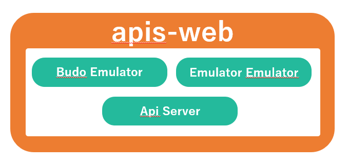
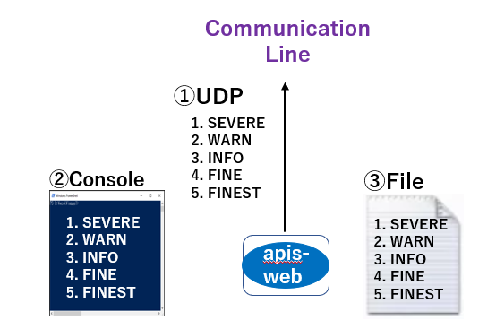

**apis-web仕様書**
====================

**Rev 0.64**

**目次**
========

[1.用語・略語](#anchor1)

[2.概要](#anchor2)

[3.ソフトウェア構成](#anchor3)

[3.1. ソフトウェアアーキテクチャ](#anchor3-1)

[3.2.ソフトウェア構成](#anchor3-2)

[4.機能説明](#anchor4)

[4.1.クラスタ構築](#anchor4-1)

[4.2.Budo Emulator](#anchor4-2)

[4.3.Emulator Emulator](#anchor4-3)

[4.4.Api Server](#anchor4-4)

[4.4.1.Deal Generator](#anchor4-4-1)

[4.4.2.Error Generator](#anchor4-4-2)

[4.4.3.Log Configurator](#anchor4-4-3)

[5.通信仕様について](#anchor5)

[5.1.Web API](#anchor5-1)

[5.2.apis-web – Grid Master間通信](#anchor5-2)

[6.収集情報](#anchor6)

[6.1.Emulator Emulator /get/log](#anchor6-1)

[6.2.Budo Emulator /deals](#anchor6-2)

[7.設定ファイルについて](#anchor7)

[7.1.config.json](#anchor7-1)

[7.2.cluster.xml](#anchor7-2)

[7.3.logging.properties](#anchor7-3)

[7.4.start.sh](#anchor7-4)

[7.5.stop-kill.sh](#anchor7-5)

[7.6.key.pem](#anchor7-6)

[7.7.cert.pem](#anchor7-7)

[8.Log出力](#anchor8)

[8.1.Log Level](#anchor8-1)

[8.2.APIS動作Log出力先](#anchor8-2)

[9.異常処理](#anchor9)

[10.セキュリティ](#anchor10)

[10.1.APIS間通信セキュリティ](#anchor10-1)

[11.プライバシー](#anchor11)

[12.OSSライセンス](#anchor12)

[13.動作環境](#anchor13)

[13.1.ハードウェア要求](#anchor13-1)

[13.2.OS要求](#anchor13-2)

**1.用語・略語**
==============

|    **用語**     | **説明**                                                                                                                                     |
|-----------------|----------------------------------------------------------------------------------------------------------------------------------------------|
| apis-main       | 自律分散制御を可能にするSony CSLが開発した電力相互融通ソフトウェアである。                                                                   |
| Grid Master     | apis-mainに含まれるServiceの名称でDC Gridを制御し電力融通を実現する。                                                                        |
| Hazelcast       | 複数のマシンにDataを分散し並列処理を行うことでアプリケーションを高速化するインメモリ分散コンピューティング運用ライブラリである。             |
| Vert.x          | 負荷分散プログラムのフレームワーク。Hazelcastライブラリを利用してEvent Busをクラスタ化しネットワーク上で負荷分散処理を行う。                 |
| Verticle        | Vert.xのプログラムの最小単位をVerticleと呼ぶ。                                                                                               |
| Event Bus       | Verticle間でお互いに通信するための非同期インターフェースをEvent Busと呼ぶ                                                                    |
| Main Controller | apis-mainがインストールされた各ノードの状態や電力融通状態をリアルタイムで表示するSony CLSが開発したWebアプリケーションのソフトウェアである。 |
| Budo            | 自律分散制御検討前の集中管理制御の自動電力融通ソフトウェアの名称である。                                                                     |
|                 |                                                                                                                                              |

**2.概要**
========

apis-webは電力融通の開発や運用保守のためのWebサービス(可視化サービスなど)に、電力融通に関わる情報を提供するソフトウェアである。apis-webはEthernet等のコミュニケーションラインに接続された複数のノード上のapis-mainから情報を取得するためにVert.x, Hazelcastのフレームワーク機能を用いてクラスタを構築する。そしてクラスタ内に存在するGrid Masterから全ノードのDC/DC Converter、Battery RSOC等のハードウェア情報を取得し、任意のノードから電力融通情報を取得する。また、Debug用に電力融通やErrorを生成する機能も有する。

図2-1

**3.ソフトウェア構成**
====================

**3.1. ソフトウェアアーキテクチャ**
-----------------------------------

図3-1はapis-webのソフトウェアアーキテクチャを示した図である。Linux OS上にJDK(Java Development Kit)、その上にイベントドリブンの負荷分散プラットフォームであるVert.xとインメモリ分散コンピューティングのHazelcastの2つのフレームワークを使用してapis-webを動作させている。 (動作確認済みOSSソフトウェアのVersionは12. OSSライセンス参照)

&emsp;&emsp;&emsp;&emsp;&emsp;&emsp;&emsp;&emsp;&emsp;&emsp;&emsp;&emsp;&emsp;&emsp;&emsp; 図3-1

**3.2ソフトウェア構成**
--------------------

apis-webは図3-2で示すように以下の3つのServiceを提供する。

1. Budo Emulator  
Main Controller等のWebアプリケーションに対してクラスタ内で発生した電力融通情報を提供し、apis-mainの全ノード及び個別ノードに対して電力融通の実行/停止等の設定変更を行うことが可能なServiceである。Main Controller等はapis-webから受け取った情報を元にクラスタ内の電力融通の状況を可視化する。(“Emulator”の名称はBudo情報の提供を模倣する機能から付けられた。)

2. Emulator Emulator  
Main Controller等のWebアプリケーションに対し、各apis-mainによって取得された全ノードのDC/DC ConverterやBattery等のハードウェア情報を提供するServiceである。(“Emulator Emulator”の名称は実機のハードウェア情報をMain Controller等のWebアプリケーションに提供するためのServiceを開発する際に、既に開発されていたDC/DCD ConverterやBattery等のハードウェアEmulatorが持つWeb APIを流用したことによりWebアプリケーション側から見るとEmulatorを模すServiceになったことからEmulator Emulatorと付けられた。)

3. Api Server  
主にDebug等の目的で以下のWeb APIを提供するService である。  
・Deal Generator : 意図的に電力融通の実行命令をクラスタ内に生成するためのWeb API  
・Error Generator : 任意のError処理命令をクラスタ内に生成するためのWeb API  
・Log Configurator : apis-mainのコミュニケーションラインへのUDP Log出力のLevelを動的に変更するための Web API  

図3-2

**4.機能説明**
============

**4.1.クラスタ構築**
 ----------------
apis-webは起動時にHazelcastと呼ばれるVert.xフレームワークが使用するクラスタリングマネージャを用いてコミュニケーションライン上に存在する複数のapis-mainとクラスタを構築する。クラスタは設定ファイルであるcluster.xmlに記載される同一クラスタ名を持つapis-mainと構築される。

**4.2.Budo Emulator**
-----------------
・Budo EmulatorはGrid Masterやノードに対して以下の情報取得や電力融通Mode設定、Shutdown処理を行う。(Global電力融通Modeは全ノードに対して、Local電力融通Modeは個別ノードに対して行うMode設定である。)

-Grid Master : クラスタ内の全ノードリスト取得  
-任意ノード : 電力融通情報取得、Global電力融通Modeステータス取得、Global 電力融通Mode設定  
-個別ノード : Local電力融通Modeステータス取得、Local電力融通Mode設定、個別Shutdown  
-全ノード : 全体Shutdown  

・電力融通Modeは以下の4種類がある。  
 -Run(autonomous):  
   クラスタ内での電力融通生成を有効にする電力融通稼働時の標準Modeである。  
 -Soft Stop(heteronomous):  
   既存の電力融通は完了まで継続するが、新たな電力融通生成は行わないModeである。Deal Generatorで強制的に電力融通を生成することは可能なため主にDebug用途として使用されるModeである。  
 -Force Stop(stop):  
   既存の電力融通を止め、Deal Generatorの強制的な電力融通生成も含めて新たな電力融通生成も行わないModeである。不具合発生時など強制的にクラスタ内の電力融通を停止させる場合に使用されるModeである。  
 -Manual(manual):  
   apis-mainの保護機能の影響を受けることなくDC/DC Converter等をManualで動作させるために使用されるDebug用のModeである。  

**4.3.Emulator Emulator**
---------------------
クラスタに参加する全ノードのDC/DC ConverterやBattery等のハードウェア情報をGrid Master経由で一括して取得することができる。

**4.4.Api Server**
--------------

**4.4.1.Deal Generator**  
Deal GenerationのWeb APIを実行するとブラウザ上に下記のWindowが開きJSON形式で電力融通情報を入力後”Generate”ボタンを押すことでクラスタ内に意図的に電力融通の実行命令を生成することができる。この機能は主にDebug等で用いられる。

**4.4.2.Error Generator**  
Error GenerationのWeb APIを実行するとブラウザ上に下記のWindowが開きErrorのカテゴリを選択後”Generate”ボタンを押すことでクラスタ内に選択したError処理を生成することができる。この機能は主にDebug等で用いられる。

**4.4.3.Log Configurator**  
コミュニケーションラインに出力されるapis-mainのUDP Logは情報漏洩や通信のトラフィック負荷を考慮してapis-mainのlogging.properties設定で出力Levelを制限されているか、出力がOFFとなっている。Debugの目的で一時的にapis-mainのUDP Logの出力Levelを変更する場合にはこの機能を使うことで動的に変更することができる。(この機能の効果は一時的でapis-main再起動後のUDP出力Levelはapis-main自身のlogging.properties設定に従う。)

**5.通信仕様について**
====================

**5.1.Web API**
-----------

Main Controller等のWebアプリケーションは下記のWeb APIにてapis-webと情報のやり取りを行うことができる。以下にそのWeb APIの仕様を説明する。

<table><thead><tr class="header"><td>
Budo

Emulator機能
</td><td>/shutdown</td><td>全体or ノード毎のシャットダウン指示</td></tr></thead><tbody><tr class="odd"><td></td><td>/setOperationMode</td><td>Global or Local のOperation Mode設定</td></tr><tr class="even"><td></td><td>/deals</td><td>電力融通情報取得</td></tr><tr class="odd"><td></td><td>/unitIds</td><td>ノードID一覧取得</td></tr><tr class="even"><td></td><td>/getStatus</td><td>Global Operation Mode取得</td></tr><tr class="odd"><td></td><td>/active</td><td>Global Operation Mode設定 (Run)</td></tr><tr class="even"><td></td><td>/quiet</td><td>Global Operation Mode設定 (Soft stop)</td></tr><tr class="odd"><td></td><td>/stop</td><td>Global Operation Mode設定 (Force stop)</td></tr><tr class="even"><td></td><td>/manual</td><td>Global Operation Mode設定 (Manual)</td></tr><tr class="odd"><td>
Emulator

Emulator機能
</td><td>/get/log</td><td>全ノードのDC/DC ConverterやBattery　RSoC等のハードウェア情報取得</td></tr><tr class="even"><td>Api Server機能</td><td>/deal</td><td>電力融通生成 (評価用)</td></tr><tr class="odd"><td></td><td>/error</td><td>Error生成 (評価用)</td></tr><tr class="even"><td></td><td>/log</td><td>apis-mainのUDP Log 出力Level変更</td></tr></tbody></table>

**5.2.apis-web – Grid Master間通信**
--------------------------------

Main Controller等のWeb アプリケーションからWeb API (“/get/log”, ”/deals”等)を受け取ったapis-webはクラスタ内のGrid Masterに対してEvent Bus上で各情報収集のためのRequestを投げGrid MasterからのReplayを待つ。apis-webからRequestを受け取ったGrid MasterはRequestの内容に応じてハードウェア情報や、電力融通情報をapis-webに返す。それらの情報を受け取ったapis-webはJSON形式でMain Controller等の要求元へ返す。

**6.収集情報**
============

**6.1.Emulator Emulator /get/log** 
------------------------------

Emulator Emulator が処理するWeb API ”/get/log” で取得可能な電力融通情報は以下である。これらの情報を1セットとして全ノード分のハードウェア情報を取得できる。

<table><thead><tr class="header"><td>apis</td><td>version</td><td>apis-main version</td></tr></thead><tbody><tr class="odd"><td></td><td>remaining_capacity_wh</td><td>Battery残容量(Wh)</td></tr><tr class="even"><td></td><td>deal_interlock_capacity</td><td>1融通 1スロットとした場合に、同時に融通可能なスロット数</td></tr><tr class="odd"><td></td><td>operation_mode.global</td><td>
クラスタ全体のOperation Mode設定

autonomous : 通常の電力融通Mode

heteronomous : 既存電力融通継続

新電力融通生成無効

stop : 電力融通停止Mode

manual : 手動Mode (評価用)
</td></tr><tr class="even"><td></td><td>operation_mode.local</td><td>
自ノードのOperation Mode設定

空 : operation_mode.global

に従う

heteronomous : 既存電力融通継続

新電力融通生成無効

stop : 電力融通停止Mode
</td></tr><tr class="odd"><td></td><td>operation_mode.effective</td><td>
有効Operation Mode

globalとlocalのOperation Modeの組み合わせにて決定
</td></tr><tr class="even"><td>oesunit</td><td>communityId</td><td>コミュニティID</td></tr><tr class="odd"><td></td><td>clusterId</td><td>クラスタID</td></tr><tr class="even"><td></td><td>id</td><td>ノードID</td></tr><tr class="odd"><td></td><td>display</td><td>ノード名称</td></tr><tr class="even"><td></td><td>sn</td><td>ノードシリアルNo.</td></tr><tr class="odd"><td></td><td>budo</td><td>
旧システムでは自動融通がActiveになっていることを示すフラグだったが、

現行システムではoperation_mode.effective

がautonomousかそれ以外かを示すフラグとなっている。

autonomous : 1

それ以外 : 0
</td></tr><tr class="even"><td></td><td>ip</td><td>IPv4</td></tr><tr class="odd"><td></td><td>Ipv6_ll</td><td>IPv6リンクローカルユニキャスト</td></tr><tr class="even"><td></td><td>Ipv6_g</td><td>IPv6グローバルユニキャスト</td></tr><tr class="odd"><td></td><td>mac</td><td>MAC address</td></tr><tr class="even"><td>battery</td><td>rsoc</td><td>相対残容量 (%)</td></tr><tr class="odd"><td></td><td>battery_operation_status</td><td>電力融通許可/不許可フラグ</td></tr><tr class="even"><td>time</td><td>apis-mainノードの時間</td><td></td></tr><tr class="odd"><td>dcdc</td><td>status.status</td><td>状態</td></tr><tr class="even"><td></td><td>status.alarm</td><td>Alarm番号</td></tr><tr class="odd"><td></td><td>status.stateAlarm</td><td>Alarm情報</td></tr><tr class="even"><td></td><td>status.statusName</td><td>DC/DC Converter Status名称</td></tr><tr class="odd"><td></td><td>status.runningState</td><td>DC/DC Converter動作 Status</td></tr><tr class="even"><td></td><td>status.operationMode</td><td>Operation Mode</td></tr><tr class="odd"><td></td><td>meter.wb</td><td>DC Grid 電力 (W)</td></tr><tr class="even"><td></td><td>meter.vg</td><td>DC Grid電圧 (V)</td></tr><tr class="odd"><td></td><td>meter.ig</td><td>DC Grid電流 (A)</td></tr><tr class="even"><td></td><td>meter.wb</td><td>Battery電力 (W)</td></tr><tr class="odd"><td></td><td>meter.vb</td><td>Battery電圧 (V)</td></tr><tr class="even"><td></td><td>meter.ib</td><td>Battery電流 (A)</td></tr><tr class="odd"><td></td><td>meter.tmp</td><td>内部温度 (℃)</td></tr><tr class="even"><td></td><td>vdis.dvg</td><td>DC Grid目標電圧値 (V)</td></tr><tr class="odd"><td></td><td>vdis.drg</td><td>DC Grid Droop率 (%)</td></tr><tr class="even"><td></td><td>param.dig</td><td>DC Grid上限電流 (A)</td></tr><tr class="odd"><td></td><td>param.ogv</td><td>DC Grid過電圧閾値 (V)</td></tr><tr class="even"><td></td><td>param.ugv</td><td>DC Grid低電圧閾値 (V)</td></tr><tr class="odd"><td></td><td>param.cib</td><td>Battery上限電流 (A)</td></tr><tr class="even"><td></td><td>param.obv</td><td>Battery過電圧閾値 (V)</td></tr><tr class="odd"><td></td><td>param.ubv</td><td>Battery低電圧閾値 (V)</td></tr></tbody></table>

**6.2.Budo Emulator /deals** 
------------------------

Budo Emulator が処理するWeb API ”/deals” で取得可能な電力融通情報は以下である。これらの情報を1セットとしてその時点で実施されている電力融通の数分の情報を取得できる。

<table><thead><tr class="header"><td>unitId</td><td>ノード識別ID</td></tr></thead><tbody><tr class="odd"><td>negotiationId</td><td>電力融通交渉ID</td></tr><tr class="even"><td>requestUnitId</td><td>電力融通をRequestしたノードID</td></tr><tr class="odd"><td>acceptUnitId</td><td>電力融通をAcceptしたノードID</td></tr><tr class="even"><td>requestDateTime</td><td>電力融通をRequestした日時</td></tr><tr class="odd"><td>acceptDateTime</td><td>電力融通をAcceptした日時</td></tr><tr class="even"><td>requestPointPerWh</td><td>Request側が提示した1Wh当たりのポイント</td></tr><tr class="odd"><td>acceptPontPerWh</td><td>Accept側が提示した1Wh当たりのポイント</td></tr><tr class="even"><td>requestDealGridCurrentA</td><td>Request側が提示した融通の電流値</td></tr><tr class="odd"><td>acceptDealGridCurrentA</td><td>Accept側が提示した融通の電流値</td></tr><tr class="even"><td>type</td><td>電力融通Requestのタイプ(充電/放電)</td></tr><tr class="odd"><td>chargeUnitId</td><td>充電側のノードID</td></tr><tr class="even"><td>dischargeUnitId</td><td>放電側のノードID</td></tr><tr class="odd"><td>pointPerWh</td><td>実際の電力融通時の1Wh当たりのポイント</td></tr><tr class="even"><td>chargeUnitEfficientGridVoltageV</td><td>充電側ノードの効率が良いGrid電圧</td></tr><tr class="odd"><td>dischargeUnitEfficientGridVoltageV</td><td>放電側ノードの効率が良いGrid電圧</td></tr><tr class="even"><td>dealGridCurrentA</td><td>電力融通時電流値(A)</td></tr><tr class="odd"><td>requestAmountWh</td><td>Request側が提示した電力量</td></tr><tr class="even"><td>acceptAmountWh</td><td>Accept側が提示した電力量</td></tr><tr class="odd"><td>dealAmountWh</td><td>電力融通時電力量(Wh)</td></tr><tr class="even"><td>dealId</td><td>電力融通情報に付与されたID</td></tr><tr class="odd"><td>createDateTime</td><td>電力融通の電力融通情報が作られた日時</td></tr><tr class="even"><td>
compensationTargetVoltage

ReferenceGridCurrentA
</td><td>電圧Referenceを担っているノードの電流補正のターゲット値 (A)</td></tr><tr class="odd"><td>activateDateTime</td><td>Constant Voltageノード側の起動を開始した日時</td></tr><tr class="even"><td>rampUpDateTime</td><td>DC Gridの電圧Ramp Upが完了した日時</td></tr><tr class="odd"><td>warmUpDateTime</td><td>Constant Currentノード側を起動した日時</td></tr><tr class="even"><td>
dischargeUnitCompensated

GridCurrentA
</td><td>電流補正後の放電電流 (A)</td></tr><tr class="odd"><td>
chargeUnitCompensated

GridCurrentA
</td><td>電流補正後の充電電流 (A)</td></tr><tr class="even"><td>startDateTime</td><td>実際の電力融通を開始した日時</td></tr><tr class="odd"><td>cumulateDateTime</td><td>実際に電力融通した電力を積算した日時</td></tr><tr class="even"><td>cumulateAmountWh</td><td>実際に電力融通した総電力量 (Wh)</td></tr><tr class="odd"><td>stopDateTime</td><td>実際の電力融通を停止した日時</td></tr><tr class="even"><td>deactiveateDateTime</td><td>電力融通後の処理が完了した日時</td></tr></tbody></table>

**7.設定ファイルについて**
========================

apis-webには複数の設定ファイルや鍵ファイル等が存在する。それらのファイルについて説明する。

**7.1.config.json**
---------------

json形式のファイルでapis-webの基本情報を設定する。起動時に一度だけ読み込まれるためパラメータを変更した場合はapis-webの再起動が必要となる。

<table><thead><tr class="header"><td>programId</td><td>プログラム識別文字列</td></tr></thead><tbody><tr class="odd"><td>comminityId</td><td>コミュニティ識別文字列で1つ以上のクラスタをまとめる上位概念のID、clusterId及びAPIS Version文字列と共に暗号化のSeedとして用いられる</td></tr><tr class="even"><td>clusterId</td><td>
クラスタ識別文字列

comminityId及びAPIS Version文字列と共に暗号化のSeedとして用いられる
</td></tr><tr class="odd"><td>security.enabled</td><td>共有メモリ暗号化とEvent Bus SSL化の有効/無効設定</td></tr><tr class="even"><td>security.pemKeyFile</td><td>Event Bus SSL化に使われる秘密鍵</td></tr><tr class="odd"><td>security.pemCertFile</td><td>Event Bus SSL化に使われる証明書</td></tr><tr class="even"><td>bodoEmulator.port</td><td>Budo Emulator用Port番号 Port = 43830</td></tr><tr class="odd"><td>emulatorEmulator.port</td><td>Emulator Emulator用 Port番号 Port = 43900</td></tr><tr class="even"><td>apiServer.port</td><td>Generate Deal, Generate Error 要Port番号 Port = 9999</td></tr><tr class="odd"><td>watchdog.enabled</td><td>APIS Alive情報有効無効設定</td></tr><tr class="even"><td>watchdog.periodMsec</td><td>Watch Dog Reset周期　(ms)</td></tr><tr class="odd"><td>watchdog.host</td><td>Watch DogがperiodMsec間隔でAccessするIP Address</td></tr><tr class="even"><td>watchdog.port</td><td>Watch DogがperiodMsec間隔でAccessするPort番号</td></tr><tr class="odd"><td>watchdog.uri</td><td>Watch DogサービスのURI</td></tr><tr class="even"><td>
watchdog.requestTimeout

Msec
</td><td>Watch DogのTimeout時間(ms)</td></tr></tbody></table>

**7.2.cluster.xml**
---------------

xml形式のファイルでHazelcastがクラスタを構築する際に必要なパラメータ(クラスタ名称、パスワード、ネットワーク設定、マルチキャスト設定等)を設定する。  
暗号化しcluster.xml.encrypted として保存される。

**7.3.logging.properties**
----------------------

Javaの標準APIであるjava.util.loggingのLogの出力に関する設定(Logファイルの保存先、Log の保存容量、Log Levelの設定等)が記述されているファイル。

**7.4.start.sh**
------------

apis-webを起動させるスクリプトファイル。OS起動時の自動実行で実行される。

以下にstart.sh内でのapis-webを起動させるコマンドを示す。

java -XX:OnOutOfMemoryError="'kill -KILL %p'" -Duser.timezone=Asia/Tokyo -Djava.util.logging.config.file=./logging.properties -jar ./apis-web-2.23.0-a01-fat.jar -conf ./config.json -cp ./ -cluster -cluster-host 192.168.0.1 &

“java”の後の引き数の意味を以下に説明する。  
-XX:OnOutOfMemoryError="'kill -KILL %p'"  　
 メモリ不足(OOM Error)発生時プロセスをKillするオプション。  
-Duser.timezone=Asia/Tokyo  
 Timezone設定。  
-Djava.util.logging.config.file=./logging.properties  
 Log構成ファイルを指定するオプション。  
-jar ./apis-web-2.23.0-a01-fat.jar  
 JARファイルの中にカプセル化されたプログラムの実行を指定するオプション。  
-conf ./config.json  
 構成ファイルを指定するオプション。  
-cp ./  
 cluseter.xmlファイルの位置を指定するオプション。  
-cluster-host 192.168.0.1 &  
 自身のIP Addressを指定するオプション。

**7.5.stop-kill.sh**
----------------

apis-webを停止させるスクリプトファイル。  
Event Bus経由のShutdown機能(stop)を実施した後、それがタイムアウトした場合に自身の  
Javaプロセスを強制終了させる処理を行う。スクリプトの中でタイムアウトを秒で指定することが可能である。  

**7.6.key.pem**
-----------

Event BusのSSL化に使われる秘密鍵である。

**7.7.cert.pem**
------------

Event BusのSSL化に使われる証明書である。

**8.Log出力**
===========

**8.1.Log Level**
-------------

Log出力にはJava標準APIのjava.util.loggingを使っており以下の7つのLevelに分類されている。APISとしては”CONFIG”, “FINER”のLevelは使用しない。これらのAPISの動作Logはlogging.propertiesファイルに記載することでLogファイルの保存先、保存するLog Level、最大Logサイズ、最大保存Log数等の設定を行っている。

\[java.util.logging Log Level\]

1. SEVERE  
実行中にErrorが発生した場合に使われるLevelである。  
このLevelのLogが出力された場合には何等かの不具合が発生したと考えられる。  
提供していないWeb API(URL)へのAccessがあった場合等。

2. WARNING    
実行中にErrorではないが期待された動作でないため警告として知らせる目的で使われるLevelである。  
Grid Masterから取得した各ノードのハードウェア情報等が空の場合。  

3. INFO  
実行中の正常系の情報を出力する際に用いられるLevelで、apis-webでは特に動作として重要なイベント処理を行った際に使われる。  
API提供Port等。  

4. CONFIG  
設定に関するLog Levelであるがapis-webとしてはこのLevelの出力は行わない。    

5. FINE  
実行中の正常系の通常動作情報を出力する際に用いられるLevelである。  
Grid Masterから取得した各ノードのハードウェア情報の取得件数等。  

6. FINER  
特定の処理についての開始及び終了の情報であるがapis-webとしてはこのLevelの出力は行わない。  

7. FINEST  
実行中の正常系の通常動作情報を出力する際に用いられるLevelである。  
例&gt; Vert.xのVerticle起動時等。  

**8.2.APIS動作Log出力先**
---------------------

apis-webの動作LogはUDP、Console、ファイルの3つの出力先がある。logging.propertiesの設定でそれぞれの出力の有無や前頁で述べた出力Levelの制限をかけることができる。UDPはコミュニケーションラインに出力されるため情報漏洩や通信のトラフィックを考慮して設定し、ファイルへの出力は不揮発性メモリの容量を考慮して設定する。

**9.異常処理**
============

不具合が発生するとFile, UDP, ConsoleにLogは出力するが、自らをリセットしたり、停止させたりする機能はない。

**10.セキュリティ**
================

**10.1APIS間通信セキュリティ**
--------------------------

apis-web - Grid Master間のやり取りはVert.x, Hazelcasフレームワーク がサポートするEvent Bus通信とHazelcast通信によって行われている。それぞれの通信ではセキュリティのため以下の方法で暗号化を行っている。

\(1\) Event Bus通信  
  -SSL公開鍵暗号方式 (RSA)  
  -SSL自己署名証明書  

\(2\) Hazelcast通信  
  -共通鍵暗号方式(AES 128bit)

**11.プライバシー**
================

Web APIによって取得できる情報が、個人情報に該当するかはapis-webの導入地域によって異なるため確認が必要である。また、個人情報に該当する場合で、持ち主の許可なく外部のサーバに送信する行為はGDPR等の個人情報保護規制の対象になる可能性があるため注意が必要である。

**12.OSSライセンス**
=================

以下にapis-webが使用するソフトウェアとそのOSSライセンスの情報を記載する。apis-webで使用するAdopt OpenJDKはライブラリのリンクのみを行っているためClasspath Exceptionが適用されGPLv2であってもapis-webのソースコードの公開を要求されない。その他のOSSソフトウェアもapis-webのソースコードの公開を要求するライセンスはない。

■apis-webで使用されるソフトウェアとそのOSSライセンス情報

<table><thead><tr class="header"><td>ソフトウェア</td><td>バージョン</td><td>ライセンス</td><td>コード改変</td></tr></thead><tbody><tr class="odd"><td>Adopt OpenJDK</td><td>11.0.4+11</td><td>GPLv2 with Classpath Exception</td><td>無</td></tr><tr class="even"><td>Vert.x</td><td>3.7.1</td><td>
デュアルライセンス(以下選択)

Eclipse Public License2.0

Apache License2.0
</td><td>無</td></tr><tr class="odd"><td>Hazelcast</td><td>3.6.3</td><td>Apache License2.0</td><td>無</td></tr><tr class="even"><td>Netty</td><td>4.1.8</td><td>Apache License2.0</td><td>無</td></tr><tr class="odd"><td>FasterXML/Jackson</td><td>2.7.4</td><td>Apache License2.0</td><td>無</td></tr></tbody></table>

※諸事情によりソフトウェアバージョンは変更される可能性があります。

**13.動作環境**
============

**13.1.ハードウェア要求**
--------------------

以下にapis-webのハードウェア要求を示す。

<table><thead><tr class="header"><td>CPUプロセッサ</td><td>
600～1000MHz, 64bit シングルコア, 32KB L1 cache以上

ARMv8推奨

(ARMv8以外のCPU採用の場合はAPISの動作確認を行う必要あり)
</th></tr></thead><tbody><tr class="odd"><td>DRAM</td><td>DDR3 1.6Gbps 1GB 以上</td></tr><tr class="even"><td>内部ストレージ</td><td>8GB以上</td></tr><tr class="odd"><td>イーサネット</td><td>20Mbps 1ポート以上, IPv4 IPv6 サポート</td></tr></tbody></table>

**13.2.OS要求**
----------

以下にapis-web用IoT BoardのOS要求を示す。

<table><thead><tr class="header"><td>種類</td><td>
64bit OS, Linux 推奨

(Linux以外のOSの場合には採用前にAPIS動作確認を行う必要あり)
</th></tr></thead><tbody><tr class="odd"><td>サイズ</td><td>
IoT Boardの内部ストレージ容量次第

(APIS等のLog保存場所用に3GB以上は確保すること)
</td></tr><tr class="even"><td>動作ソフトウェア</td><td>AdoptOpenJDK (32/64bit)</td></tr><tr class="odd"><td>OSSライセンス</td><td>GPL等のコピーレフト型ライセンスの影響を避けるため、それらのライセンスを持つソフトウェアとapis-webが1つの実行ファイルとなるOSは禁止 (例:RTOS)</td></tr><tr class="even"><td>その他</td><td>OS起動時にapis-web等の自動実行が行えること</td></tr><tr class="odd"><td></td><td>ssh login/scpファイル転送が行えること</td></tr><tr class="even"><td></td><td>logrotage等でログを定期的にリネーム/圧縮/削除が行えること</td></tr><tr class="odd"><td></td><td>IPv4アドレスを固定できること</td></tr><tr class="even"><td></td><td>ntp serverと時間の同期が行えること</td></tr></tbody></table>

  [**1.** **用語・略語** 5]: #用語略語
  [**2.** **概要** 6]: #概要
  [**3.** **ソフトウェア構成** 6]: #ソフトウェア構成
  [**3.1. ソフトウェアアーキテクチャ** 6]: #ソフトウェアアーキテクチャ
  [**3.2.** **ソフトウェア構成** 7]: #ソフトウェア構成-1
  [**4.** **機能説明** 8]: #_Toc38014243
  [**4.1.** **クラスタ構築** 8]: #クラスタ構築
  [**4.2.** **Budo Emulator** 8]: #budo-emulator
  [**4.3.** **Emulator Emulator** 9]: #emulator-emulator
  [**4.4.** **Api Server** 9]: #api-server
  [**4.4.1.** **Deal Generator** 9]: #deal-generator
  [**4.4.2.** **Error Generator** 9]: #error-generator
  [**4.4.3.** **Log Configurator** 10]: #log-configurator
  [**5.** **通信仕様について** 11]: #_Toc38014265
  [**5.1.** **Web API** 11]: #web-api
  [**5.2.** **apis-web – Grid Master間通信** 11]: #apis-web-grid-master間通信
  [**6.** **収集情報** 12]: #収集情報
  [**6.1.** **Emulator Emulator /get/log** 12]: #emulator-emulator-getlog
  [**6.2.** **Budo Emulator /deals** 14]: #budo-emulator-deals
  [**7.** **設定ファイルについて** 16]: #設定ファイルについて
  [**7.1.** **config.json** 16]: #config.json
  [**7.2.** **cluster.xml** 17]: #cluster.xml
  [**7.3.** **logging.properties** 17]: #logging.properties
  [**7.4.** **start.sh** 17]: #start.sh
  [**7.5.** **stop-kill.sh** 18]: #stop-kill.sh
  [**7.6.** **key.pem** 18]: #key.pem
  [**7.7.** **cert.pem** 18]: #cert.pem
  [**8.** **Log出力** 19]: #log出力
  [**8.1.** **Log Level** 19]: #log-level
  [**8.2.** **APIS動作Log出力先** 20]: #apis動作log出力先
  [**9.** **異常処理** 21]: #異常処理
  [**10.** **セキュリティ** 21]: #セキュリティ
  [**10.1.** **APIS間通信セキュリティ** 21]: #apis間通信セキュリティ
  [**11.** **プライバシー** 21]: #プライバシー
  [**12.** **OSSライセンス** 22]: #ossライセンス
  [**13.** **動作環境** 23]: #動作環境
  [**13.1.** **ハードウェア要求** 23]: #ハードウェア要求
  [**13.2.** **OS要求** 23]: #os要求
